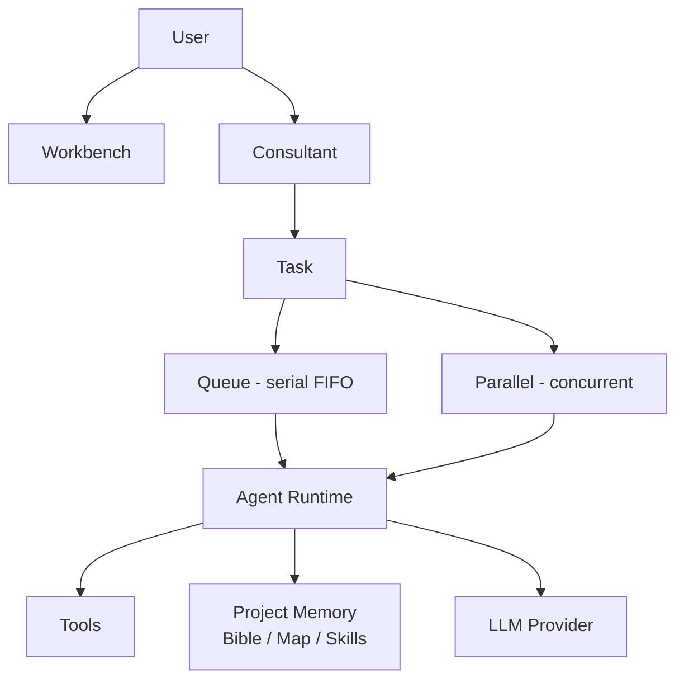

# AETHER

### Autonomous AI Coding Agent

**AETHER gives an LLM the tools, project intelligence, and execution environment it needs to work on real software projects autonomously.**

```
AETHER = Hands
LLM    = Brain
```

The LLM remains the decision-maker. AETHER provides the hands: filesystem tools, terminal, project navigation, and a runtime that lets the model investigate, edit, run, and validate code over multiple rounds without human micromanagement.

---

## What is AETHER?

AETHER is a coding agent engine plus a workbench for running it. You describe a task in natural language; AETHER prepares context, streams the agent's reasoning, executes tools, and reports results.

Core idea:

```
User prompt
  → Task Preparation (context + advisory plan)
    → Agent Runtime (continuous loop)
      → LLM decides → Tool calls → Observations → LLM decides → ...
    → Validation / Result → Report
```

No heuristic "done" detector. The loop ends only when the LLM returns a final response without requesting a tool.

---

## How It Works

```
User
 │
 ├── Workbench (web UI)
 │
 └── Consultant (read-only advisor)
       │
       ↓
     Task
       │
       ├── Queue      ─┐
       └── Parallel   ─┤
                       ↓
                 Agent Runtime
                       │
                ┌──────┼─────────┐
                ↓      ↓         ↓
              Tools  Project    LLM
                     Memory
```

Relationship of the memory layers:

```
Bible → WHAT   (knowledge about the project)
Map   → WHERE  (where code lives — navigation/lookup)
Skill → HOW    (how to do things — procedural guidance)
Tool  → ACTION (capability the LLM can invoke)
LLM   → DECISION
```

`Map` is a lookup mechanism (`atlas_query`, `rig_query`, `project_map_status`). It is not injected wholesale into the LLM context.

---

## Key Features

### Autonomous Agent

- Continuous Native Tool Calling loop — one conversation per task.
- LLM-driven tool selection (no hard-coded step order).
- Multi-round execution with retry, investigation, implementation, and validation.
- Plan (when present) is advisory only — the LLM decides actual tool order.
- Cooperative cancellation (`Stop` at a safe boundary).
- Activity phase telemetry (`planning` / `inspecting` / `editing` / `running` / `validating`) derived from real tool usage.

### Agent vs Consultant

```
Agent
→ execute / modify the project
→ read + write + run commands
→ can create / update / delete Skills

Consultant
→ inspect / investigate / analyze / propose
→ read-only against project source code
→ may read and update Project Bible via a curated tool
→ never gets write/edit/delete/move capabilities on source
```

Consultant reuses the same loop and tool infrastructure but with a curated read-only registry and a separate permission policy. It supports two workflow modes:

| Mode | Purpose | Retrieval bound (Map) |
|------|---------|-----------------------|
| `quick` | Fast Q&A, light investigation | lower (e.g. 3 Atlas + 3 RIG) |
| `investigate` | Deeper exploration | higher (e.g. 6 Atlas + 6 RIG) |

Mode controls which tools the LLM is offered and the prompt instructions — it is not just a prompt prefix. When the bound is reached, map tools are removed from the offer and the model is asked to answer from evidence already gathered.

Consultant can optionally include images (base64, bounded) — processed through the existing vision module — and can emit a Task Proposal:

````markdown
```task
Fix the login redirect bug by updating auth middleware...
```
````

The proposal can be sent to the Agent with one click via the existing task flow.

### Project Intelligence

Project-local, additive, and stored under `<project>/.aether/` — no new databases.

| Layer | Location | Purpose |
|-------|----------|---------|
| **Bible** | `.aether/bible/` | Structured markdown knowledge (`architecture.md`, `conventions.md`, `facts.md`, `decisions.md`, `learnings.md`, `problems.md`, …) plus `index.md` manifest. Read as context; updated once per task (Agent) or explicitly via Consultant. |
| **Map** | `.aether/map/` | `atlas.json` (CODE ATLAS) + `rig.json` (MAP_CODE_RIG) + `*.meta.json` freshness metadata. Generated via vendored engines in `vendor/`. |
| **Environment** | `.aether/ENVIRONMENT.md` | OS / shell / runtime context — built once per session, injected on the first task. |
| **Log** | `.aether/log/<task_id>.log` | Append-only JSON Lines — source of truth for Task History, Activity, and Report. |

**Bible = WHAT, Map = WHERE, Skill = HOW, Tool = CAPABILITY.** Map provides navigation; the LLM looks up locations and then reads the actual files. Staleness is detected deterministically (SHA-256 over `.py` source), but regeneration is never automatic — the LLM/Agent decides when to call `refresh_project_map`.

Relevant tools: `project_map_status`, `atlas_query`, `rig_query`, `refresh_project_map` (Agent only; Consultant gets the first three).

### Skill System

Dynamic, progressive, and shared by Agent and Consultant.

```
skill_catalog
↓
LLM chooses 0 / 1 / N skill_ids
↓
load_skill(skill_id)  →  .aether/bible/skills/<skill_id>/skill.md
↓
load_skill_reference(skill_id, reference)  →  references/<reference> (on demand)
```

- **Dynamic IDs** — any `skill_id` matching `^[A-Za-z0-9._-]+$` (1–64 chars); directory names are not hard-coded.
- **Progressive loading** — catalog returns only lightweight metadata (`skill_id`, `name`, `description`, `scope`, `location`). Content is loaded only when the LLM asks for it.
- **References are optional** — loaded individually by path, never all at once.
- **Shared mechanism** — Agent and Consultant use the same `SkillStore` (`agent_ai.projects.skills` / `agent_ai.tools.skills`). No second storage, no duplicate loader.
- **Permissions differ**:
  - Read tools (`skill_catalog`, `load_skill`, `load_skill_reference`) — available to both.
  - Lifecycle tools (`create_skill`, `update_skill`, `delete_skill`) — **Agent only**, LLM-driven. Consultant remains read-only.
- **No automatic selector** — no keyword matcher, scoring, or heuristic. The LLM decides whether to create / update / delete a Skill.
- **Scope** — currently `project` (`project` is the only supported value today; the design is generic for future scopes).
- **Storage** — `SkillStore` with atomic writes, idempotent `ensure()`, and tolerant parsing (corrupt files are skipped, not crashed).

Skills are guidance/context, not a permission grant and not an auto-loaded context compressor.

### Provider & Model

Provider and model are configured independently.

- Provider types are registered in `agent_ai.providers.registry` (`ollama`, `deepseek`, `openrouter`, `openai`, `9router`, `custom` / OpenAI-compatible). Adding a provider means registering a class with a unique `name` — core never imports a concrete provider.
- **Configuration is stored in SQLite** (`data/aether.db`) via `agent_ai.llm_config.LLMConfigService`. The same database is used by the gateway launcher. Tables: `llm_provider_instances` and `llm_models`.
- Each **Provider Instance** points to an env-var name (`api_key_env`, e.g. `OPENROUTER_API_KEY`), not the secret value. The secret stays in `.env`; the DB stores only the variable name, base URL, and metadata.
- Each instance can have multiple **Models**. Selection is `Provider Instance → Model` (one instance, many models).
- **OpenAI-compatible / custom provider** is a first-class entry (`CustomOpenAIProvider`). Any base URL + API key + model string can be wired through it, including self-hosted OpenAI-compatible endpoints.
- Resolution at runtime uses `agent_ai.providers.factory.build_provider_from_config` — the same path for Agent and Consultant.
- No hard-coded "recommended" model list in the README; the architecture is provider-agnostic and the UI reads available providers/models from the service.

### Queue & Parallel Agent

AETHER executes tasks in two modes that coexist:

```
Execution
├── Queue      — serial / FIFO
└── Parallel   — immediate, concurrent
```

**Queue**

- Task joins the existing queue and waits for the global serial slot (1 execution slot).
- FIFO by `queue_order`; `Move Up / Down` reorders.
- `Disable` (`queue_state: disabled`) keeps a task from being scheduled without cancelling it.
- `Remove` is only for non-running tasks.

**Parallel**

- Task starts its own Agent immediately, without waiting for the queue slot.
- Multiple parallel tasks can run concurrently with each other and with the one queue task occupying the serial slot.
- Each task carries its own Provider + Model (no global override).
- There is no artificial limit on the number of parallel agents.

Queue and Parallel coexist — a parallel task never blocks the queue slot and a queue task never blocks parallel tasks.

**File Write Lock**

Parallel agents share an in-process lock on write tools to prevent simultaneous writes to the same file:

```
Agent A → write_file(example.py)
           ↓
         lock acquired
           ↓
         write
           ↓
        unlock

Agent B → write_file(example.py)
           ↓
        locked
           ↓
      tool error
           ↓
     LLM reads error → decides next step
```

- Applies to `write_file`, `edit_file`, `delete_file`, `move_file` (both paths for `move_file` are locked atomically).
- Read tools remain unrestricted.
- `run_command` is not part of the File Write Lock.
- The lock is temporary — held only for the duration of the write operation, not the whole task.
- Errors are returned through the existing tool error path; no new error channel. The LLM decides how to proceed (retry, pick another file, etc.).
- This is not absolute filesystem isolation — it is a cooperative in-process guard within the same runtime process.

### Workbench

Vue 3 + Vite frontend (`web/frontend`) and a thin Django gateway (`web/django_app`). No agent logic lives in the frontend.

- **Task input** — Task Composer modal (task text + Provider Instance + Model + Execution mode + retrieval profile).
- **Provider / Model / Execution** — separate selectors. Execution is `Queue` or `Parallel`. The UI reads choices from `GET /api/config` and `GET /api/llm/providers` — nothing is hard-coded.
- **Agent Workbench** — Latest Task card, lifecycle progress (Planning → Completed), duration ticker, and unified Agent Activity timeline (tool calls, observations, phase changes).
- **Consultant** — chat modal with quick/investigate mode, image attachments, and Task Proposal → Run with the same Provider/Model selectors.
- **Task History & Queue** — History reads from `.aether/log/` (persistent); Queue reflects `GET /api/tasks/queue` (pending/running/disabled). Both are the same global queue the backend uses.
- **Changes & Explorer** — live filesystem changes (diff, additions/deletions) and a file tree bound to the active project root. Editor is Monaco.
- **Task status** — `prepared` / `running` / `queued` / `validating` / `completed` / `failed` / `cancelled`.
- **Stop confirmation** — Stop does not act immediately:

```
Stop
↓
Confirmation dialog
↓
Cancel  →  dismiss, task continues
Stop    →  cooperative cancellation at safe boundary → CANCELLED
```

Send and Stop are separate actions — Send is always available (new task becomes `pending`/`queued` if the slot is occupied).

### Telemetry

Available on the task card and via Activity / SSE events. All values are derived from existing lifecycle events, not estimates:

```
Provider      — from provider_request / provider_response
Model         — from the same events
Execution     — Queue / Parallel (from TaskRecord)
Round         — LLM invocation count (provider_request count)
LLM Rounds    — same as Round
Tool Calls    — tool_called count
Tokens        — provider-reported usage (total / prompt+completion / prompt_eval+eval); "—" if not reported
Duration      — from task_started → task_completed/failed/cancelled timestamps
Status        — completed / failed / cancelled / running / queued
```

No local tokenizer estimate is used for Tokens.

---

## Security & Permissions

- **Workspace boundary** — every filesystem and terminal tool resolves paths with `_resolve_within_root` and `cwd = project root`. Traversal and symlink escape are denied. `shell=False` for commands.
- **Permission layer** (`agent_ai.permission`) — `PermissionPolicy` classifies actions (`READ_ONLY`, `WORKSPACE_WRITE`, `DELETE_MOVE`, `COMMAND_EXECUTION`, …) and decides `ALLOW / DENY / REQUIRE_APPROVAL`. Default is `ALLOW` when disabled (backward-compatible).
- **Agent vs Consultant boundary** — Consultant gets `read_only: ALLOW`, `workspace_write: DENY`, `delete_move: DENY`, `external_network: DENY`. Its registry is also curated (no write/move/delete tools), so the boundary is layered: policy + registry + retrieval bound.
- **Skill read tools are not a bypass** — loading a skill does not grant write capability. Lifecycle tools are only registered on the Agent registry.
- **Secrets** — API keys stay in `.env`. SQLite holds only `api_key_env` names. Responses mask secrets (`sk-o***…`).
- **No absolute claims** — these are project-bound, best-effort guards within the workspace root. They are not a sandbox or cross-process isolation boundary.

---

## Architecture



Runtime per task:

```
PreparedTask → AgentRuntime → AgentOrchestrator.run_continuous_loop
               → Provider.generate → LLMResponse (tool_calls / final)
               → ToolExecutor → ToolRegistry
               → observation (role: tool) → Provider.generate → ...
               → DONE / FAILED / CANCELLED
```

---

## Project Structure

```
.
├── src/agent_ai/            # Core library (agent, tools, providers, project intelligence)
│   ├── browser/             # Browser automation
│   ├── capabilities/        # Capability declarations
│   ├── codeindex/           # Code indexer
│   ├── config/              # Settings (python-dotenv)
│   ├── consultant/          # Consultant service, guard, policy, prompt
│   ├── context/             # Context builder
│   ├── core/                # Orchestrator, executor, cancel, observability
│   ├── llm_config/          # Provider Instance / Model service (SQLite)
│   ├── permission/          # Permission policy & classifier
│   ├── projects/            # AetherProjectStore, Bible, Map, Skills, discovery
│   ├── providers/           # BaseProvider + ollama / openai_compatible / custom / …
│   ├── runtime/             # AgentRuntime, activity, models
│   ├── task/                # Task preparation
│   ├── tools/               # Filesystem, workspace, terminal, project_map, skills
│   └── validation/          # Validation runner
├── web/
│   ├── django_app/          # Thin HTTP gateway (api/services.py, api/views.py)
│   │   ├── api/             # Execution bridge, streaming (SSE), project_store
│   │   └── config/          # Django settings
│   └── frontend/            # Vue 3 + Vite workbench (src/App.vue, src/api.js)
├── scripts/                 # install_aether.py, check_*.py verifiers
├── tests/                   # Project tests
├── vendor/                  # Vendored engines: CODE_ATLAS, MAP_CODE_RIG
├── data/                    # SQLite DB (data/aether.db), version.json
├── projects/                # Example / registered project roots
└── run.bat                  # Self-bootstrapping launcher (double-click)
```

`.aether` layout (created inside the active project root when a Skill / Bible entry / log is written):

```
.aether/
├── bible/
│   ├── index.md
│   ├── architecture.md
│   ├── conventions.md
│   ├── decisions.md
│   ├── facts.md
│   ├── learnings.md
│   ├── problems.md
│   └── skills/                 # created when the first Skill is made
│       └── <skill_id>/
│           ├── skill.md
│           └── references/     # optional
├── map/
│   ├── atlas.json
│   ├── rig.json
│   ├── atlas.meta.json
│   └── rig.meta.json
├── log/
│   └── <task_id>.log
├── github/                     # optional — GitHub backup config (DPAPI on Windows)
└── ENVIRONMENT.md
```

On a fresh clone the `.aether/` directory does not need to exist — it is created on demand. The layout above is the contract used when Skills / Bible entries / maps are written.

---

## Getting Started

### Prerequisites

- Python 3.10+
- Git
- Node.js (for frontend build — installed automatically by `run.bat` / `scripts/install_aether.py`; manual install only needed for frontend dev)

### 1. Get the code

```bat
git clone https://github.com/adigayung/aether-agent.git
cd aether-agent
```

Or just download and double-click `run.bat` — it will clone to `aether-agent/` next to the launcher if no installation is found.

### 2. Configure providers

Copy the template and fill in what you need:

```bat
copy .env.example .env
```

`LLMConfigService` is the source of truth for Provider Instance → Model. You can configure providers two ways:

- **Via the Workbench** — open Settings after first launch: add a Provider Instance (type + base URL + `api_key_env` name), add Models, and set API keys (written to `.env` masked in responses).
- **Via `.env` directly** — set `OPENAI_API_KEY`, `DEEPSEEK_API_KEY`, `OLLAMA_HOST`, etc. These are used as fallbacks and for the env-var names that instances point to.

Context budgets are optional:

```ini
CONTEXT_KNOWLEDGE_MAX_TOKENS=8000
CONTEXT_MAX_TOKENS=16000
```

### 3. Run AETHER

Double-click `run.bat`, or from a terminal:

```bat
python scripts/install_aether.py
```

What it does (idempotent — safe to run repeatedly):

1. Verifies Python and Git
2. Creates `venv/` and installs `requirements.txt`
3. Ensures `.env` exists
4. Builds `web/frontend/dist` if missing (`vite build`)
5. Starts the gateway at `http://127.0.0.1:8000/` and opens a browser

Useful flags:

```bat
python scripts/install_aether.py --check          # verify prerequisites only
python scripts/install_aether.py --no-launch      # setup without starting server
python scripts/install_aether.py --simulate       # dry-run (no downloads / writes)
```

Manual alternative (after `venv` is ready):

```bat
venv\Scripts\activate
python web\django_app\manage.py runserver 127.0.0.1:8000
```

Deployment template: see `deployment.template` (checked in without secrets) for the environment variables consumed in a deployment. The verifier `scripts/check_packaging.py` ensures it contains no real API keys.

### 4. Create a task

1. Open `http://127.0.0.1:8000/`.
2. Pick or create a Project in the launcher.
3. Add a Provider Instance + Model in Settings if none exists.
4. Click the input bar → Task Composer → write the task, pick **Provider**, **Model**, and **Execution** (`Queue` or `Parallel`), then Send.

### 5. Queue vs Parallel

- **Queue** — task waits for the serial slot (FIFO). Use for edits to the same area.
- **Parallel** — task starts immediately and can run alongside others. Use for independent areas.

Both appear in the global Task Queue; History is the persistent `.aether/log/` archive.

---

## Example Workflows

Single task:

```
User:
  "Fix authentication bug — login redirect drops session after OAuth callback"

AETHER:
  → reads Project Bible / Map
  → searches and inspects auth code
  → edits the relevant file(s)
  → runs validation / tests
  → reports the result with a diff summary
```

Parallel:

```
Task A → "Add calculator module (src/calc/*)"   → Parallel
Task B → "Restyle login page (web/login.html)"  → Parallel

— Both start immediately.
— Each uses its own Provider + Model.
— File Write Lock prevents them from clobbering the same file;
  independent files proceed without contention.
```

Consultant → Agent:

```
Consultant (investigate):
  "Where is session handled and what could cause the drop?"

Consultant → Task Proposal (```task fence)

User clicks Run Task → task is created via the normal Queue/Parallel path.
```

These are conceptual examples, not benchmarks.

---

## Design Principles

- LLM remains the decision maker — no heuristic auto-selector or forced completion.
- Provider / tool agnostic — core never imports a concrete provider; tools are registered generically.
- Project-first — all writes are project-local (`.aether/` inside the target root).
- Modular — gateway, runtime, tools, and project intelligence are thin facades over existing components.
- Progressive disclosure — catalog before content; references on demand; no bulk injection.
- Avoid unnecessary reads / tool calls — duplicate reads return `already_available` / `already_read` / `already_searched` and the agent is expected to use what it already has.
- No heuristic stop — the loop ends on the LLM's final response.
- No unnecessary context compression — `compression.enabled` stays `false`; no automatic truncation.
- Agent and Consultant separation — different registries, different permission policies, same loop infrastructure.

---

## Roadmap

### Implemented

```
Implemented
├── Autonomous Agent (continuous Native Tool Calling loop)
├── Consultant (quick / investigate, read-only, Task Proposals)
├── Project Intelligence (Bible / Atlas / RIG / Maps with freshness)
├── Skill System (catalog → load_skill → load_skill_reference, Agent lifecycle)
├── Provider & Model architecture (instances + models in SQLite, OpenAI-compatible/custom)
├── Queue (serial FIFO) + Parallel Agent (concurrent, File Write Lock)
├── Workbench (task composer, history, activity, changes, explorer, Monaco editor)
├── Telemetry (provider/model/round/tool calls/tokens/duration/status)
└── Permission & workspace boundary
```

### Future

```
Future
├── Extension System
└── Advanced multi-agent / God Mode
```

Extension System and God Mode are planned directions and are not yet implemented.

---

## License

MIT — see [LICENSE](LICENSE).
