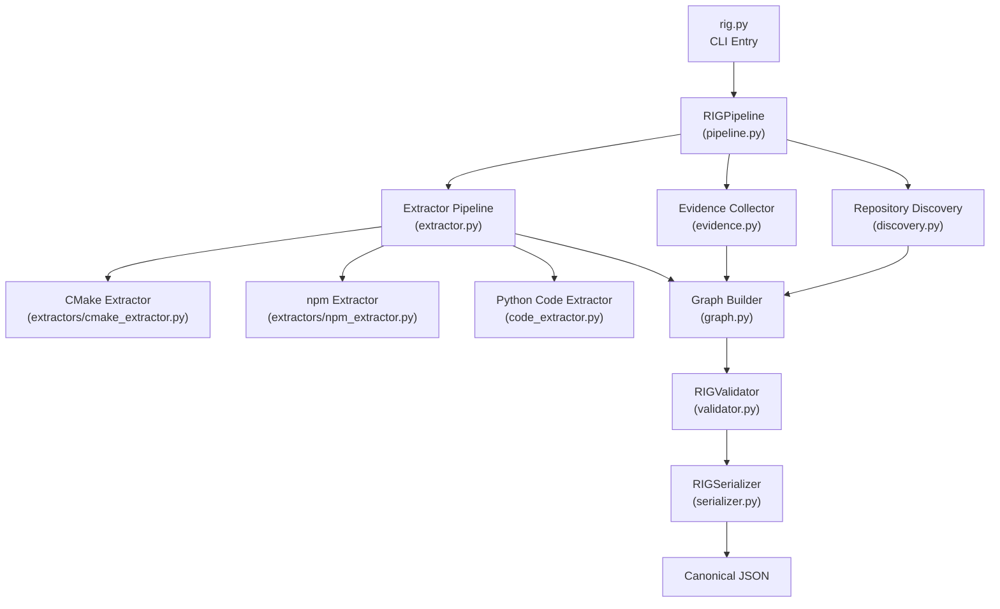

# MAP_CODE_RIG — Repository Intelligence Graph Generator

**Deterministic build/test architecture analysis for any repository.**

MAP_CODE_RIG is a standalone Python tool that analyzes a source repository and produces a canonical **Repository Intelligence Graph (RIG)** in JSON format. The RIG captures the build/test architecture of a repository: buildable components, tests, dependencies, package managers, runners/scripts, and evidence-backed relationships — all with deterministic identity.

> **Deterministic**: the same repository input always produces byte-for-byte identical JSON output, making it suitable for CI pipelines, caching, and LLM context injection.

---

## Table of Contents

- [Overview](#overview)
- [How It Works](#how-it-works)
- [Architecture](#architecture)
- [Installation](#installation)
- [Usage](#usage)
- [Output Format](#output-format)
- [Supported Project Types](#supported-project-types)
- [Development](#development)
- [Known Limitations (V1)](#known-limitations-v1)
- [License](#license)

---

## Overview

MAP_CODE_RIG transforms a source code repository into a structured **Repository Intelligence Graph** — a flat, evidence-backed JSON representation of how the repository is built, tested, and organized. It answers questions like:

- What buildable components exist (executables, libraries, packages)?
- How do components depend on each other?
- What test suites exist and what do they test?
- What package managers and external dependencies are used?
- What build profiles are detected (CMake, npm, etc.)?
- What scripts/runners are available?
- What code entities (classes, functions, modules) exist and how do they relate?

The tool is **language-agnostic** at the build level; language-specific logic is isolated into plugin extractors. The graph is **provider-agnostic** — no dependency on any LLM, API, or cloud service.

### Key Design Principles

- **Evidence before interpretation**: Every node and edge is backed by evidence references pointing to the source files or build artifacts that justify them.
- **No silent repair**: Failures are reported as diagnostics, never silently fixed.
- **UNKNOWN is valid**: Missing information is explicitly marked rather than guessed.
- **Stable identity**: IDs derived from semantic keys, not creation order.
- **Read-only by default**: The tool never modifies the repository.
- **No network required**: Core extraction works entirely offline.

---

## How It Works

The pipeline transforms a repository root into a structured RIG through six sequential phases:

```
User runs CLI → Pipeline Orchestrator →
  1. Repository Discovery (find build markers, manifests, lockfiles)
  2. Evidence Collection (capture file/line references)
  3. Extractor Plugins (CMake, npm, Python AST — each produces entities + relationships)
  4. Graph Assembly (deduplicate, merge, build edge connections)
  5. Validation (structural checks: unique IDs, endpoint existence, acyclic deps)
  6. Canonical Serialization (compact sequential integer IDs, sorted arrays)

→ Writes canonical JSON file
```

Each phase is deterministic: given the same repository at the same state, every step produces identical intermediate and final output.

### Extractor Plugin System

Build-system-specific logic lives in isolated **extractor plugins**:

| Plugin | Source | Entities Extracted |
|--------|--------|-------------------|
| **CMake** | CMake File API (primary), CMakeLists.txt regex (fallback) | Targets (executable, library), CTest definitions, build dependencies |
| **npm** | package.json, package-lock.json, yarn.lock | Packages, scripts, external dependencies, runners |
| **Python Code** | Python `ast` standard library parser | Files, modules, classes, functions, imports, calls, inheritance |

Each plugin follows an "evidence-first" approach: no relationship is created merely because two entities "look related" — every fact must be traceable to a source.

---

## Architecture

The architecture follows a layered pipeline design with clear separation of concerns.



### Module Overview

| Module | Responsibility |
|--------|---------------|
| `rig.py` | CLI entry point, argument parsing, output writing |
| `rig/cli.py` | Argument parser, fatal error handler, diagnostic printer |
| `rig/config.py` | Configuration constants, build system markers, ignore patterns |
| `rig/pipeline.py` | Pipeline orchestrator — coordinates all phases |
| `rig/discovery.py` | Targeted repository discovery (build markers, manifests, lockfiles) |
| `rig/evidence.py` | Evidence collection with deduplication by deterministic ID |
| `rig/extractor.py` | Abstract plugin framework and result merging |
| `rig/graph.py` | Graph assembly — deduplication, endpoint verification |
| `rig/identity.py` | Deterministic SHA-256 identity generation from semantic keys |
| `rig/models.py` | All data models: Component, Edge, Evidence, RIG, etc. |
| `rig/serializer.py` | Canonical JSON serialization with compact sequential integer IDs |
| `rig/validator.py` | Structural validation (unique IDs, endpoints, acyclic deps) |
| `rig/code_extractor.py` | Python source-code mapping via standard library `ast` |
| `rig/extractors/cmake_extractor.py` | CMake build system extractor plugin |
| `rig/extractors/npm_extractor.py` | npm/JavaScript build system extractor plugin |

---

## Installation

### Requirements

- **Python 3.10+**
- **No external dependencies** — uses only the Python standard library.

### Setup

```bash
# Clone the repository
git clone https://github.com/adigayung/MAP_CODE_RIG.git
cd MAP_CODE_RIG

# (Optional) Create a virtual environment
python -m venv .venv
.venv\Scripts\activate   # Windows
source .venv/bin/activate  # Linux/macOS

# No pip install required — just run rig.py directly
```

---

## Usage

```bash
python rig.py <project_path> <output_path> [--overwrite] [--verbose] [--version]
```

### Arguments

| Argument | Description |
|----------|-------------|
| `project_path` | Path to the repository/project to analyze (required) |
| `output_path` | Path for the output JSON RIG file (required) |
| `--overwrite` | Overwrite output file if it exists |
| `--verbose` | Enable verbose diagnostic output to stderr |
| `--version` | Show version and exit |

### Examples

```bash
# Basic analysis — generate RIG for a project
python rig.py ./my_project ./map_project.json

# Overwrite existing output with verbose diagnostics
python rig.py ./my_project ./map_project.json --overwrite --verbose

# Analyze a CMake-based project
python rig.py ./cmake_project ./cmake_rig.json --verbose

# Analyze an npm-based project
python rig.py ./npm_project ./npm_rig.json --verbose
```

### Exit Codes

| Code | Meaning |
|------|---------|
| 0 | Success (output written, even with validation warnings) |
| 1 | Fatal error (invalid args, cannot write output, pipeline failure) |

Diagnostics are printed to stderr. If validation errors occur, the output is still written with diagnostic annotations.

---

## Output Format

The output is a canonical JSON file conforming to the `rig-json/v1` schema. The top-level structure:

```json
{
  "schema_version": "rig-json/v1",
  "generator": {
    "name": "map_code_rig",
    "version": "1.0.0"
  },
  "repo": {
    "name": "my_project",
    "primary_language": "cxx",
    "languages": ["c", "cxx"],
    "build_profile_ids": [1, 2],
    "snapshot_fingerprint": null,
    "revision": null,
    "vcs": null,
    "analysis_status": "complete",
    "evidence_ids": [3, 5, 7]
  },
  "build": {
    "profiles": [
      {
        "id": 1,
        "name": "cmake-root",
        "build_system": "cmake",
        "identity_key": "build|cmake|scope=",
        "evidence_ids": [3]
      }
    ],
    "primary_profile_id": 1,
    "evidence_ids": [3]
  },
  "components": [
    {
      "id": 2,
      "kind": "component",
      "name": "my_executable",
      "type": "executable",
      "programming_language": "cxx",
      "source_files": ["src/main.cpp", "src/foo.cpp"],
      "identity_key": "component|profile=...|target=my_executable",
      "evidence_ids": [5],
      "build_profile_ids": [1]
    }
  ],
  "aggregators": [],
  "runners": [],
  "tests": [],
  "external_packages": [],
  "package_managers": [],
  "code_files": [],
  "code_modules": [],
  "code_classes": [],
  "code_functions": [],
  "code_symbols": [],
  "edges": [
    {
      "id": 42,
      "type": "depends_on",
      "source": 2,
      "target": 4,
      "evidence_ids": [5],
      "role": "build",
      "origin_plugin": "cmake"
    }
  ],
  "evidence": [
    {
      "id": 5,
      "locator_kind": "file",
      "file_path": "CMakeLists.txt",
      "start_line": 12,
      "end_line": 15
    }
  ],
  "diagnostics": [],
  "unresolved_references": []
}
```

### Key Design Features of the Output

- **Compact sequential integer IDs**: All entity IDs are sequential integers (1..N) derived from sorted canonical string IDs, making the output significantly more compact while remaining fully deterministic.
- **Sorted arrays**: All node arrays are sorted by ID for deterministic ordering.
- **Evidence-backed**: Every component, edge, and node references evidence items that justify their existence.
- **First-class edges**: Relationships are full objects with type, role, qualifier, and evidence — not just string lists.
- **Compatibility projections**: `depends_on_ids` and `external_packages_ids` on component nodes are derived from the authoritative `edges[]` array.

---

## Supported Project Types

| Build System | Detection | Extraction Method | Status |
|-------------|-----------|------------------|--------|
| **CMake** | `CMakeLists.txt` | CMake File API (primary), regex fallback | ✅ Production |
| **npm** | `package.json` | package.json + lockfile parsing | ✅ Production |
| **Python** | `.py` files | AST (standard library `ast` module) | ✅ Production |
| Maven | `pom.xml` | Detection only (extraction planned) | 🔜 Future |
| Cargo | `Cargo.toml` | Detection only (extraction planned) | 🔜 Future |
| Go | `go.mod` | Detection only (extraction planned) | 🔜 Future |
| Meson | `meson.build` | Detection only (extraction planned) | 🔜 Future |

The **Python Code Extractor** (`PythonCodeExtractor`) uses the standard library `ast` module to extract:

- **Code files** and **modules** (with package detection via `__init__.py`)
- **Classes** (with base class extraction and inheritance edges)
- **Functions** and **methods** (with containment edges)
- **Symbols** for imports (`import X`, `from X import Y`)
- **Edges**: `contains`, `imports`, `invokes`, `inherits`
- **Unresolved references** for symbols that cannot be resolved locally

---

## Development

### Project Structure

```
MAP_CODE_RIG/
├── rig.py                        # CLI entry point
├── README.md                     # This file
├── FINAL_RIG_BLUEPRINT.md        # Architecture blueprint (source of truth)
├── rig/
    ├── __init__.py
    ├── cli.py                    # CLI argument parsing
    ├── config.py                 # Configuration constants
    ├── discovery.py              # Repository discovery
    ├── evidence.py               # Evidence collection
    ├── extractor.py              # Extractor plugin framework
    ├── graph.py                  # Graph assembly
    ├── identity.py               # Deterministic identity generation
    ├── models.py                 # Core data models
    ├── pipeline.py               # Pipeline orchestrator
    ├── serializer.py             # Canonical JSON serializer
    ├── validator.py              # RIG validation
    ├── code_extractor.py         # Python source-code mapping
    └── extractors/
        ├── __init__.py
        ├── cmake_extractor.py    # CMake build system extractor
        └── npm_extractor.py      # npm/JS build system extractor

```

### Extending with New Plugins

To add a new build system extractor:

1. Create a new file in `rig/extractors/<name>_extractor.py`
2. Implement the `ExtractorPlugin` abstract class (see `rig/extractor.py`)
3. Implement `name`, `detect()`, and `extract()` methods
4. Register the plugin in `RIGPipeline.run()` (in `rig/pipeline.py`)

The plugin framework handles graceful failure: if one plugin fails, others continue extraction.

---

## Known Limitations (V1)

These are **design decisions** for the current version and will be addressed in future releases:

| Limitation | Current State | Future Direction |
|-----------|--------------|-----------------|
| **CMake extraction** | Fallback regex parsing (CMakeLists.txt) | Full CMake File API integration |
| **npm extraction** | package.json + lockfile as primary sources | Workspace-aware monorepo support |
| **Cross-file resolution** | Only intra-file resolution for Python AST | Full cross-file symbol resolution |
| **Incremental updates** | Full recomputation on each run | Delta-based incremental updates |
| **AST/symbol graph** | Python `ast` only | Multi-language AST extraction |
| **SQLite persistence** | Not implemented | Optional SQLite backing store |
| **Python source mapping** | Standard library `ast` only | Type-aware resolution, stub support |
| **Maven/Cargo/Go/Meson** | Detection only | Full extraction plugins |

See `FINAL_RIG_BLUEPRINT.md` for the complete architecture specification, open questions, and future roadmap.

---

## License

MIT License — see the [LICENSE](LICENSE) file for details.
